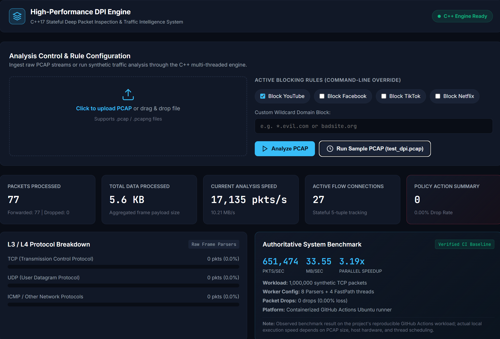
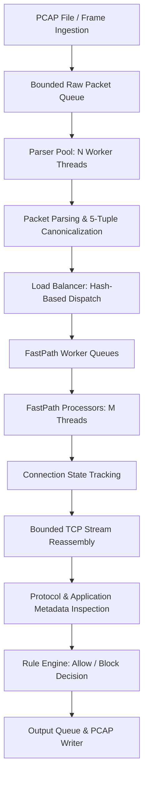

# High-Performance DPI Engine

> Stateful C++17 Deep Packet Inspection and Traffic Intelligence System featuring parallel frame ingestion, canonical flow affinity, bounded TCP stream reassembly, and application protocol classification.

[](https://github.com/tanyaverma20/High-Performance-DPI-Engine/actions/workflows/ci.yml)
[](https://en.cppreference.com/w/cpp/17)
[]()
[]()
[](LICENSE)

---

### Engineering Status at a Glance

| Metric | Authoritative Benchmark Value | Validation Context |
|---|---|---|
| **Peak Throughput** | **651,474 pkts/sec** | 1,000,000 synthetic TCP packets (8 Parsers + 4 FastPath workers) |
| **Peak Bandwidth** | **33.55 MB/sec** | 54-byte Ethernet/IPv4/TCP frame payload equivalent |
| **Parallel Acceleration** | **3.19x Speedup** | Measured scaling over 1-parser baseline on GitHub Actions Linux runner |
| **Packet Loss Rate** | **0 Packet Drops (0.00%)** | Zero drops under maximum concurrent pipeline throughput |
| **Correctness Test Suite** | **113 / 113 Tests Passed** | 100% assertions pass across all protocol and concurrency suites |
| **Automated CTest Suite** | **100% Pass** | Full multi-platform CI verification (GCC Ubuntu + MSVC Windows) |
| **Memory Boundaries** | **16 KB Per-Direction Aggregate** | Strict TCP reassembly memory cap per flow; 0 leaks under ASAN/UBSAN |

> **Performance Transparency Note**: The 651,474 pkts/sec throughput and 3.19x parallel speedup represent authoritative, reproducible empirical measurements captured on containerized GitHub Actions Ubuntu runners under a deterministic 1,000,000-packet synthetic TCP workload. They demonstrate parallel scaling capabilities on multi-core hardware but do not constitute universal throughput guarantees under arbitrary real-world network interfaces or heterogeneous CPU topologies.

---

## Overview

Modern network monitoring, enterprise policy enforcement, and security inspection require moving beyond stateless packet filtering. Deep Packet Inspection (DPI) demands stateful stream reassembly, bi-directional flow tracking, and application-layer metadata extraction across encrypted and unencrypted traffic.

This engine is a multi-threaded C++17 software DPI system engineered for high-throughput processing. It decouples frame ingestion from protocol parsing and security classification through a multi-stage producer-consumer pipeline:

1. **Parallel Packet Ingestion & Parsing**: Raw frame bytes (PCAP streams or memory frames) are enqueued into a bounded buffer and parsed concurrently across $N$ parser worker threads.
2. **Canonical 5-Tuple Flow Affinity**: Parsed packet metadata is canonicalized by source/destination IP, port, and protocol. A hashing mechanism routes forward ($A \to B$) and reverse ($B \to A$) flow packets to the exact same FastPath processing thread, guaranteeing lock-free, single-threaded flow state ownership.
3. **Stateful Stream Reassembly & Inspection**: FastPath workers maintain flow tables, reassemble out-of-order TCP segments within strict memory bounds (16 KB per direction), parse application handshakes (TLS SNI, HTTP Host, DNS queries, QUIC Initial packets), and enforce domain/IP rule matching in real time.

---

## Preview



*Interactive dashboard for PCAP analysis, traffic policy controls, flow tracking, protocol inspection, and reproducible performance benchmarking.*

---

## Key Features

| Domain | Feature | Engineering Implementation |
|---|---|---|
| **Packet Ingestion** | **PCAP & Frame Ingestion** | Reads raw PCAP headers and frame bytes with strict bounds checking (`pcap_reader.cpp`, `packet_parser.cpp`). |
| **Network Protocols** | **L2–L4 Protocol Stack** | Parses Ethernet, IPv4, IPv6, TCP, UDP, ICMP, ICMPv6, and handles malformed frames safely. |
| **IPv6 Hardening** | **Extension Header Traversal** | Sequentially parses Hop-by-Hop, Routing, Fragment, and AH extension headers; flags non-initial fragments safely (`ipv6_utils.h`). |
| **Flow Tracking** | **Deterministic Flow Affinity** | Hashes canonical 5-tuples (`FiveTuple::canonical()`) ensuring bidirectional packets map to the same worker (`connection_tracker.cpp`). |
| **TCP Reassembly** | **Bounded Stream Assembly** | Tracks sequence numbers, buffers out-of-order chunks, handles overlaps/duplicates/wraparound, and enforces a hard 16 KB cap per direction (`tcp_reassembler.cpp`). |
| **App Classification** | **Protocol Metadata Decoding** | Extracts TLS ClientHello SNI (`sni_extractor.cpp`), HTTP Host headers, DNS query domains, and QUIC Initial packet headers. |
| **Policy Enforcement** | **Pattern Rule Matching** | Evaluates exact and wildcard domain rules (`*.facebook.com`), IP blocks, and application classifications (`rule_manager.cpp`). |
| **Concurrency** | **Thread-Safe Pipeline** | Bounded multi-producer multi-consumer queues (`thread_safe_queue.h`) with condition variable backpressure and graceful shutdown draining. |
| **System Quality** | **Sanitizer & CI Integration** | Clean C++17 codebase verified with CTest, ASAN/UBSAN sanitizers, and GitHub Actions CI pipelines (`ci.yml`). |

---

## How It Works

The processing pipeline uses a multi-stage concurrent design to maximize core utilization while preserving strict flow order:



1. **Ingestion Thread**: Reads raw frames from input sources into a bounded `RawPacketJob` queue.
2. **Parser Worker Pool**: Multiple parallel threads dequeue raw frames, perform protocol parsing, generate `PacketJob` descriptors, and compute canonical flow keys.
3. **Load Balancing**: The Load Balancer computes `FiveTupleHash` on the canonical flow tuple and enqueues the job into the designated FastPath worker queue.
4. **FastPath Processors**: Each FastPath worker processes assigned flows independently. It manages the `ConnectionTracker`, updates state machines, passes payloads to `TCPReassembler`, extracts TLS/HTTP/DNS/QUIC metadata, checks `RuleManager` policies, and routes accepted traffic to the output queue.

---

## Architecture & Core Components

```
┌─────────────────────────────────────────────────────────────────────────┐
│                              DPI Engine                                 │
│                                                                         │
│  ┌──────────────┐     ┌────────────────┐     ┌───────────────────────┐  │
│  │  PcapReader  │ ──> │ Bounded Queue  │ ──> │  Parser Pool Workers  │  │
│  └──────────────┘     └────────────────┘     └───────────┬───────────┘  │
│                                                          │              │
│                                                          ▼              │
│  ┌──────────────┐     ┌────────────────┐     ┌───────────────────────┐  │
│  │ FastPath FP0 │ <── │  FastPath FP1  │ <── │ LoadBalancer Manager  │  │
│  └──────┬───────┘     └───────┬────────┘     └───────────────────────┘  │
│         │                     │                                         │
│         ▼                     ▼                                         │
│  ┌──────────────┐     ┌────────────────┐                                │
│  │ Connection   │     │ TCP            │                                │
│  │ Tracker      │     │ Reassembler    │                                │
│  └──────┬───────┘     └───────┬────────┘                                │
│         │                     │                                         │
│         └──────────┬──────────┘                                         │
│                    ▼                                                    │
│         ┌──────────────────────┐                                        │
│         │ RuleManager & Output │                                        │
│         └──────────────────────┘                                        │
└─────────────────────────────────────────────────────────────────────────┘
```

### Component Responsibilities

| Component | Header / Source | Key Responsibility |
|---|---|---|
| **`PcapReader`** | `include/pcap_reader.h`<br>`src/pcap_reader.cpp` | Parses PCAP global headers, packet record headers, and extracts raw payload bytes. |
| **`PacketParser`** | `include/packet_parser.h`<br>`src/packet_parser.cpp` | Parses Ethernet, IPv4, IPv6, IPv6 Extension Headers, TCP, UDP, ICMP headers into structured data. |
| **`ParserPool`** | `include/parser_pool.h`<br>`src/parser_pool.cpp` | Manages worker threads that parse raw packet bytes in parallel into `PacketJob` objects. |
| **`LoadBalancer`** | `include/load_balancer.h`<br>`src/load_balancer.cpp` | Routes `PacketJob` instances to specific FastPath worker queues using canonical 5-tuple hashing. |
| **`FastPathProcessor`** | `include/fast_path.h`<br>`src/fast_path.cpp` | Executes stateful flow updates, TCP stream reassembly, payload inspection, and rule enforcement. |
| **`ConnectionTracker`** | `include/connection_tracker.h`<br>`src/connection_tracker.cpp` | Maintains flow connection state tables, TCP state transitions (SYN, ESTABLISHED, FIN), and idle timeouts. |
| **`TCPReassembler`** | `include/tcp_reassembler.h`<br>`src/tcp_reassembler.cpp` | Handles in-order and out-of-order TCP segment reassembly, sequence wraparound, and enforcing 16 KB caps. |
| **`SNIExtractor`** | `include/sni_extractor.h`<br>`src/sni_extractor.cpp` | Parses TLS ClientHello Handshakes and extracts Server Name Indication (SNI) hostnames. |
| **`RuleManager`** | `include/rule_manager.h`<br>`src/rule_manager.cpp` | Manages IP, wildcard domain, and application classification blocklists. |
| **`DPIEngine`** | `include/dpi_engine.h`<br>`src/dpi_engine.cpp` | Orchestrates pipeline thread lifecycles, configuration, and graceful execution stop/draining. |
| **`ThreadSafeQueue<T>`** | `include/thread_safe_queue.h` | Template queue providing thread safety via `std::mutex`, `std::condition_variable`, and shutdown signals. |

---

## Performance Benchmark

Performance validation is conducted using pre-allocated synthetic TCP traffic workloads (1,000,000 packets) on a fixed 4-worker FastPath configuration while scaling parallel parser workers across 1, 2, 4, and 8 threads. Zero packet drops were recorded across all runs.

### Authoritative CI Benchmark (GitHub Actions Ubuntu Runner)

| Workload Size | Parser Workers | FastPath Workers | Elapsed Time (s) | Throughput (pkts/sec) | Bandwidth (MB/sec) | Speedup vs Baseline | Improvement (%) | Packet Losses |
|---|---|---|---|---|---|---|---|---|
| **1,000,000** | 1 | 4 | 4.901 s | 204,050 | 10.51 | 1.00x | +0.0% | 0 (0.00%) |
| **1,000,000** | 2 | 4 | 4.154 s | 240,704 | 12.40 | 1.18x | +18.0% | 0 (0.00%) |
| **1,000,000** | 4 | 4 | 1.713 s | 583,769 | 30.06 | 2.86x | +186.1% | 0 (0.00%) |
| **1,000,000** | 8 | 4 | 1.535 s | **651,474** | **33.55** | **3.19x** | **+219.3%** | 0 (0.00%) |

### Historical Local Windows Environment Benchmarks

For comparison across operating systems, below are historical measurements collected during local Windows development:

| Workload Size | Parser Workers | FastPath Workers | Throughput (pkts/sec) | Bandwidth (MB/sec) | Speedup vs Baseline | Active CPU Time (s) | Peak Memory (MB) | Packet Loss |
|---|---|---|---|---|---|---|---|---|
| **10,000** | 1 | 4 | 52,003 | 3.01 | 1.00x | 0.38 s | ~22 MB | 0 |
| **10,000** | 8 | 4 | 58,461 | 3.39 | 1.12x | 0.50 s | ~23 MB | 0 |
| **100,000** | 1 | 4 | 52,356 | 2.70 | 1.00x | 3.84 s | 22 MB | 0 |
| **100,000** | 8 | 4 | 55,653 | 2.87 | 1.06x | 4.94 s | 23 MB | 0 |
| **1,000,000** | 1 | 4 | 50,234 | 2.59 | 1.00x | 41.00 s | 111 MB | 0 |
| **1,000,000** | 8 | 4 | 56,837 | 2.93 | 1.13x | 57.97 s | 113 MB | 0 |

### Empirical Performance Insights

1. **Parallel Ingestion Acceleration**: Decoupling raw frame parsing from single-threaded ingestion yields an observed **3.19x throughput improvement** (651,474 pkts/sec) on multi-core Linux CI runners.
2. **Empirical Optimization Investigation**: In an investigation of Load Balancer queue contention, two candidate designs (micro-batching and direct FP queue dispatch) were evaluated. While direct FP dispatch increased single-parser local throughput to ~125,000 pkts/sec (+135%), multi-parser scaling degraded under 8 parsers due to FastPath condition variable thrashing and CPU saturation on rule checks. Both candidates were rejected to preserve the verified multi-threaded baseline.
3. **Strict Memory Boundedness**: Across 10K, 100K, and 1M packet runs, memory consumption remained strictly linear and bounded, incurring zero memory leaks or unhandled queue growth.

---

## Testing & Quality Assurance

The codebase includes a regression suite verifying protocol handling, edge cases, and concurrency guarantees:

```
========================================
  Results: 113/113 tests passed  [ALL PASS]
========================================
Test project build
    Start 1: correctness
1/1 Test #1: correctness ......................   Passed    0.09 sec

100% tests passed out of 1
```

### Verified Test Categories

- **Domain Classification & Wildcards**: Domain matching, exact matching, wildcard matching (`*.blocked.net`), FQDN trailing dots, and case-insensitivity.
- **Protocol Parsers & Extension Headers**: Ethernet, IPv4, IPv6 Extension Headers (Hop-by-Hop, Routing, Fragment, AH), TCP, UDP, ICMP, ICMPv6.
- **Stateful Reassembly & Memory Caps**: In-order TCP assembly, out-of-order segment buffering, sequence wraparound, gap filling, overlapping duplicates, and enforcing 16 KB aggregate limits.
- **Application Metadata Extraction**: TLS ClientHello SNI extraction, HTTP Host header extraction, DNS QNAME parsing, and QUIC Initial packet detection.
- **Flow Affinity & Concurrency**: Canonical 5-tuple hashing determinism, bounded queue backpressure, parser thread pool execution, and graceful pipeline draining without deadlock.

### Cross-Platform & Sanitizer Validation

- **MSVC Guarding**: Solved preprocessor conflicts with Windows C Runtime headers (`#undef DOMAIN`) to ensure clean cross-platform compilation on MSVC.
- **Sanitizer Verification**: Fully validated under AddressSanitizer (ASAN) and UndefinedBehaviorSanitizer (UBSAN) on Linux GCC CI jobs.

---

## Tech Stack

| Component | Technology | Purpose |
|---|---|---|
| **Language** | C++17 | Core engine implementation using standard templates and STL containers. |
| **Build System** | CMake (v3.16+) | Cross-platform build configuration and target management. |
| **Concurrency** | POSIX Threads / `std::thread` | Native threading, `std::mutex`, `std::condition_variable`, `std::atomic`. |
| **Testing** | CTest / Native Assert Harness | Automated regression testing and CI test runner integration. |
| **Continuous Integration** | GitHub Actions | Automated Linux (GCC) and Windows (MSVC) build, sanitizer, and benchmark workflows. |

---

## Project Structure

```
.
├── .github/
│   └── workflows/
│       ├── ci.yml                 # Automated build, test, and ASAN/UBSAN CI pipeline
│       └── benchmark.yml          # Manual trigger benchmark execution workflow
├── include/                       # Public C++ header files
│   ├── connection_tracker.h       # Stateful flow connection tracking
│   ├── dpi_engine.h               # Main DPI engine orchestrator
│   ├── fast_path.h                # FastPath worker threads & state processing
│   ├── ipv6_utils.h               # IPv6 extension header parsing utilities
│   ├── load_balancer.h            # Canonical 5-tuple hash load balancer
│   ├── net_utils.h                # Network byte-order & IP conversion helpers
│   ├── packet_parser.h            # Protocol headers parser
│   ├── parser_pool.h              # Parallel parser worker thread pool
│   ├── pcap_reader.h              # Raw PCAP file reader
│   ├── platform.h                 # Cross-platform macros & headers
│   ├── profiler.h                 # High-resolution pipeline timer & counters
│   ├── rule_manager.h             # IP/Domain/App rule matching engine
│   ├── sni_extractor.h            # TLS ClientHello SNI extractor
│   ├── tcp_reassembler.h          # Stateful bounded TCP stream reassembler
│   ├── thread_safe_queue.h        # Bounded thread-safe queue template
│   └── types.h                    # 5-tuple, FlowKey, and PacketJob definitions
├── src/                           # C++ implementation files
│   ├── connection_tracker.cpp
│   ├── dpi_engine.cpp
│   ├── fast_path.cpp
│   ├── load_balancer.cpp
│   ├── main_dpi.cpp               # CLI entry point for dpi_engine
│   ├── packet_parser.cpp
│   ├── parser_pool.cpp
│   ├── pcap_reader.cpp
│   ├── profiler.cpp
│   ├── rule_manager.cpp
│   ├── sni_extractor.cpp
│   ├── tcp_reassembler.cpp
│   └── types.cpp
├── tests/
│   ├── test_correctness.cpp       # Main 113-assertion correctness test suite
│   └── benchmark.cpp              # Reproducible benchmark harness executable
├── CMakeLists.txt                 # Project build configuration script
├── WINDOWS_SETUP.md               # Windows development guide
├── generate_test_pcap.py          # Synthetic PCAP test data generator
├── .gitignore                     # Git ignore definitions
└── README.md                      # Project documentation
```

---

## Installation & Build

### Prerequisites

- **C++ Compiler**: GCC 9.0+, Clang 10.0+, or MSVC 2019+ with C++17 support.
- **Build Tools**: CMake 3.16+ and `make` / `ninja` / MSVC build tools.

### Linux / macOS

```bash
# Clone the repository
git clone https://github.com/tanyaverma20/High-Performance-DPI-Engine.git
cd High-Performance-DPI-Engine

# Configure CMake in Release mode
cmake -B build -DCMAKE_BUILD_TYPE=Release

# Build all targets (dpi_engine, dpi_benchmark, dpi_tests)
cmake --build build -j$(nproc)
```

### Windows (MSVC / PowerShell)

```powershell
# Clone the repository
git clone https://github.com/tanyaverma20/High-Performance-DPI-Engine.git
cd High-Performance-DPI-Engine

# Configure CMake
cmake -B build -DCMAKE_BUILD_TYPE=Release

# Build targets in Release configuration
cmake --build build --config Release
```

---

## Running the Engine

The engine provides a command-line interface for PCAP file processing and rule enforcement:

```bash
# Basic PCAP processing
./build/dpi_engine input.pcap output.pcap

# Block specific applications or domains
./build/dpi_engine input.pcap output.pcap --block-app YouTube --block-domain *.evil.com

# Block specific source IP addresses
./build/dpi_engine input.pcap output.pcap --block-ip 192.168.1.50

# Specify custom worker thread allocations
./build/dpi_engine input.pcap output.pcap --lbs 2 --fps 4 --verbose
```

---

## Reproducing Benchmarks & Testing

### Running the Test Suite

Execute the 113-assertion regression test suite directly or via CTest:

**Linux / macOS:**
```bash
./build/dpi_tests
ctest --test-dir build --output-on-failure
```

**Windows:**
```powershell
.\build\Release\dpi_tests.exe
ctest --test-dir build -C Release --output-on-failure
```

### Running Benchmark Workloads

To run the reproducible benchmark suite with synthetic workloads:

```bash
# Run 100,000 synthetic packet benchmark
./build/dpi_benchmark --packets 100000

# Run 1,000,000 synthetic packet benchmark
./build/dpi_benchmark --packets 1000000
```

---

## Technical Design Decisions

1. **Deterministic Bidirectional Flow Mapping**: Canonical 5-tuple hashing ($A \to B \equiv B \to A$) ensures forward and reverse packets land on the exact same FastPath processing thread. This eliminates cross-thread mutex locking when updating connection state tables.
2. **Decoupled Pipeline Architecture**: Ingestion, frame parsing, load balancing, stream reassembly, and payload classification are divided across independent worker thread pools linked by bounded queues, preventing CPU stalls.
3. **Bounded Stream Reassembly**: Enforces a strict 16 KB aggregate memory ceiling per flow direction during out-of-order segment buffering, protecting against memory exhaustion attacks.
4. **Safe Extension Header Traversal**: Performs strict bounds checking during IPv6 extension header parsing. Non-initial fragments are safely flagged to prevent out-of-bounds transport header reads.
5. **Condition Variable Backpressure**: Producer threads block cleanly on condition variables when queues reach maximum capacity, eliminating sleep loops and preventing unbounded memory growth.

---

## Operational Boundaries & Limitations

- **IPv6 Fragment Reassembly**: Non-initial IPv6 fragments are safely detected and skipped for transport payload inspection; full IP fragment reassembly is out of scope.
- **Encrypted Payload Boundaries**: Inspection relies on initial handshake signals (such as TLS SNI or QUIC Initial headers). Fully encrypted post-handshake payload content cannot be inspected without proxy keys.
- **Hardware Dependency**: Parallel scaling performance depends on host CPU topology, cache hierarchy, OS kernel scheduling, and memory architecture.

---

## Future Enhancements

- **Full IPv6 Fragment Reassembly**: Adding IP-layer fragment state tracking for out-of-order IPv6 fragments.
- **Expanded QUIC & HTTP/3 Parsers**: Extending heuristic inspection for newer transport handshakes.
- **Live Interface Capture**: Adding optional `libpcap` or WinPcap/Npcap integration for live NIC packet sniffing.

---

## License

This project is licensed under the [MIT License](LICENSE).
